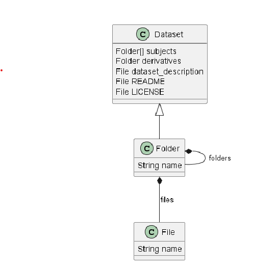

# Explanation of the In-Memory Graph in ancpBIDS

The in-memory graph in ancpBIDS is a data structure that represents a BIDS dataset in a way that makes it easier to interact with. Instead of constantly reading and writing from the filesystem, which is slow and inefficient, ancpBIDS loads the dataset into memory as a graph.

## 1. The model of a BIDS dataset.
The dataset is structured as a graph with nodes and edges. The root node is the **Dataset**, which in itself is a **Folder** and can contain **Folder** and **File** nodes. Each **Folder** can contain more **Folder** and **File** nodes.

Folders and files have special meaning in the BIDS specification, determined by their naming scheme and location within the directory structure. BIDS filenames are build with key-value pairs, for example, a folder named *sub-02/* follows the *”sub-<label>”* name pattern, indicating that it belongs to the **Subject** sub-class.

In a similar way, Files also follow this key-value pairs, followed by a suffix and file extension, are called **Artifacts** (not to be confused with neuroimaging noise sources); and are treated differently according to the properties of its filename. For example, sub-02_task-rest_bikd.nii.gz.

This hierarchical structure of a BIDS dataset, resembles a graph. This structure allows ancpBIDS to model the in-memory graph. Every folder and file works as a node, and their *containment* relationship, the edges of the graph.

Finally, there are some special files and folders:
* **dataset_description.json:** it is mandatory in BIDS dataset. It works like an identity card and contains key metadata like the dataset name, BIDS version and author information. It is modeled as a node in the in-memory graph of ancpBIDS:
* **DerivativeFolder:** is a sub-class of Folder. It contains the processed version of the dataset. IDerivatives Folder often have their own new directory and file structure different from the main dataset. Even if BIDS specification does not fully specify how a derivative folder should be structured; it must include the dataset_description.json with information of the dataset and the analysis pipeline.
* **Metadata:** also known as Sidecar files they are JSON files that provide additional information about the neuroimaging data files. They must have the same key-value pairs in their filenames as the data they belong to (sub-02_task-rest_bold.json).

## 2. The in-memory graph

ancpBIDS creates an implementation level data structure that machines can operate on. This graph/model is a static technical projection of the BIDS schema that allows to create instances that represent files and folders on the file system. 

The following figures show two sifferent simple instances of graph structure. In both, the root node is the dataset, which contains Folders and File nodes. Each Folder might contain more Folder and File nodes.

 The in-memory graph is built in **four layers**. This enables fast queries, ensures compatibility (thanks to BIDS schema) and modular processing. The graph construction is handled inside the DatasetPopulationPlugin class.

* **Layer one:** The first layer **scans the whole directory**, starting from the root dataset, and creates the Folder and File nodes.

  

* **Layer two:** The files that conform to the BIDS specification are **converted from File to Artifact nodes**. For this purpose, Artifact nodes are expanded with additional synthetic nodes, such as the entities (key-value pairs), suffix and file extension.

  

* **Layer three:** **Expands metadata files** with synthetic nodes based on schema-files. For example, the dataset_description.json file, is expanded to contain the synthetic nodes for the Name, Authors and BIDSversion. This allows direct access to dataset properties.

  

* **Layer four:** Finally, it convert Folder nodes inside *derivatives/ folder* of the dataset into a DerivativeFolder nodes. This helps anpcBIDS to distinguish between raw and processed data.

  

