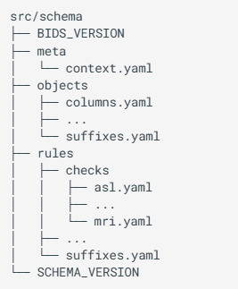

# Introduction to ancpBIDS

ancpBIDS was developed and is maintained within the **Applied Neurocognitive Psychology (ANCP) Lab**. It provides tools for handling I/O (Input/Output) tasks in BIDS datasets, with a focus on maintaining a lightweight structure and attempting to keep partial backwards compatibility with pyBIDS.

* **Significant performance optimization.** thanks to its **in-memory graph representation**, ancpBIDS efficiently manages the loading process of datasets across multiple layers. A benchmark comparing dataset loading and querying performance showed that ancpBIDS performs efficiently across various dataset sizes.


* **Maintainable and clean implementation.** A modular structure helps to control the complexity and minimizes transitive dependencies, making ancpBIDS lightweight and attractive for third-party integration. This design also encourages community contributions and future extensibility.

* **Support for multiple BIDS schema versions.** ancpBIDS adapts to different BIDS versions based on the dataset’s version declaration and the BIDS schema.

  
```{admonition} In-memory graph?
:class: tip
If you want to learn more how ancpBIDS uses the BIDS specification to build the in-memory graph representation (and what exactly is a in-memory graph representation), [follow this link](guide/inmemory.md).

```

## What is BIDS? 

*"Neuroimaging experiments result in complex data that can be arranged in many different ways, and for a long time, there was no consensus on how to organize and share data obtained in neuroimaging experiments. **Brain Imaging Data Structure (BIDS)**, describes a simple and easy to adopt way of organizing neuroimaging and behavioral data"* (Gorgolewski et al., 2016; Niso et al., 2018). 


The **[BIDS Specification](https://bids-specification.readthedocs.io/en/stable/)** defines the rules for data organizing and naming conventions. It is continuously updated thanks to community efforts. To ensure that the Specifications are implemented consistently, BIDS provides **[BIDS Schema](https://bids-specification.readthedocs.io/en/stable/appendices/schema.html)**, a machine readable representation written in YAML format. The BIDS Schema describes the different possible objects (BIDS concepts), rules (for naming filepaths and contents) and meta (the context to which rules can be applied).




```{admonition} Would you like to know more about the BIDS specification?

You can find more information the BIDS Specification on their [official BIDS webpage](https://bids.neuroimaging.io/).

```


## Next section
In the next section, we'll walk through the installation and basics for the tutorial.


