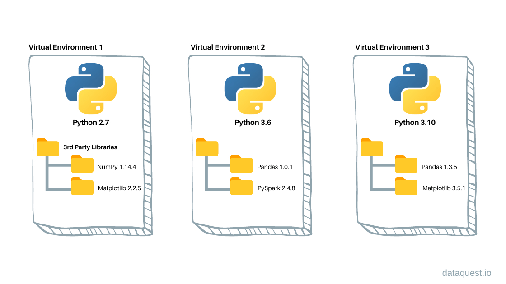

# Let's get started with ancpBIDS

## Installation
To install ancpBIDS, run the following command in your terminal:

```bash
pip install ancpbids
```

It can also be upgraded:

```bash
pip install --upgrade ancpbids
```

## Download an existing BIDS dataset

ancpBIDS was build for BIDS compatible datasets. Therefore, we offer you to download a test dataset from our [github](https://github.com/ANCPLabOldenburg/ancp-bids-dataset) so you can follow this tutorial. We offer you two types: a MEG dataset *(ds003483)* and a MRI dataset *(ds005)*. If you have your own BIDS dataset, feel free to use yours instead. 

```{warning}
These datasets are only meant to learn how to use ancpBIDS, and are not expected to be used in any kind of research. 
```


## Virtual environments
Before starting with the tutorial, we want to briefly explain you about virtual environments and containerization.
Virtual environments create isolated and self-contained workspaces, allowing us to manage project-specific dependencies separated from system-wide installation. This isolation has several benefits:
- **Avoid dependency conflicts:** prevents interferences between project-specific and system-wide dependencies, such as common erors related to version mismatches.
- **Transparency and Open Science:** Ensures that others can replicate your results and reproduce your analysis reliably.



### Create and activate your virtual environment
The following steps should be run from a **Bash terminal** (e.g.,  your Linux shell, WSL, macOS Terminal, or Git Bash). These are not Python commands.

1. Navigate to the directory where you want to create the environment using the `cd` command in the terminal.

```bash
cd /path/to/your/project
```

3. Create the virtual environment:

```bash
python3 -m venv <your_environment_name>
```

4. Activate the virtual environment:

```bash
source /path/to/environment/bin/activate
```

# Next section
In the next section we will show how to use ancpBIDS to fetch datasets and perform basic queries.


