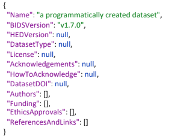

# Create a Derivative
An important functionality of ancpBIDS is to create and write derivatives. 

> In the examples in this page, we'll create a derivative that extracts basic MEG header information from raw files and stores it as JSON sidecar files.
 
## Create a Derivative in the Memory Graph
The function `create_derivative` registers a derivative within the [in-memory graph](https://ancplaboldenburg.github.io/ancpbids_documentation/extra/inmemory.html). The given name (e.g., _"Meg_QC"_) will be the derivatives' folder name.  You can also add as well as a description to the derivatives folder (e.g., `dataset_description`). This step only defines what will be written later.

```bash
  DERIVATIVE_NAME = "Meg_QC"
  derivative = dataset.create_derivative(name= DERIVATIVE_NAME)
  derivative.dataset_description.GeneratedBy.Name = "MEG header extraction"
```

### Create a Folder
The function `create_folder` creates new folders and subfolders, for example pipelines (e.g., _"calculation/"_).

```bash
    PIPELINE_FOLDER = "calculation" 
    calculation_folder = derivative.create_folder(name = PIPELINE_FOLDER)
```

You can also use the function `create_folder` to create subject folder specifying the `schema`.

```bash
for sid in subjects:

  subject_folder = calculation_folder.create_folder(
            type_=schema.Subject,
            name="sub-" + sid
  )
```


## very old

`write_derivative()` saves the provided derivative folder to the dataset. Note that a ‘derivatives’ folder will be created if not present. Optionally, you may also use the `DatasetOptions` class to set your preference in the handling of writing a derivative to your file system.


```bash
from ancpbids import write_derivative

target_dir = '/path/to/your/target/directory'
write_derivative(dataset, target_dir)
```


```{important}

TODO: provide a more elaborative example using write_derivative() (deprecated) and artifact.write() (preferred)

```

-->

<!--
# Saving a Dataset

Once you've queried and worked with your BIDS dataset, you may want to save your dataset to your local file system. This can be done with several functions. 
the ´load_dataset()´ function. Optionally, you may also  also use the ´DatasetOptions´ class to set your preference in the handling of reading (and writting) a dataset from your file system. In the following example we will use the ´dataset_path´ you have queried beforehand.

## Saving a Dataset
Once your work is finished with your dataset, you can save it back to disk using ´save_dataset()´. Your ´target directory´ should be empty.


    from ancpbids import save_dataset

    target_dir = '/path/to/your/traget/directory'
    save_dataset(dataset, target_dir)

    #ValueError: No file writer registered for file: /.../sub-009_ses-1_scans.tsv


When calling `save_dataset()`, the [in-memory graph](https://ancplaboldenburg.github.io/ancpbids_documentation/extra/inmemory.html) materializes as a new folder on disk. This is done "schema-aware": following the syntax and the semantic BIDS specification, such as naming Artifacts with correct key-value pairs. The new folder will contain the [dataset_description.json](https://alexisbaxman.github.io/ancpbids_documentation/extra/inmemory.html#the-model-of-a-bids-dataset), with the field `BIDSVersion` derived directly from the schema.



```{note}
For each subject, a separate folder is created, and **Artifacts are named automatically:** the key-value information (such as *'sub-09'*) is inferred from the folder structure. This writting functionally allows to export fully valid BIDS derivatives dynamically and automatic within pipelines. 

```
-->


