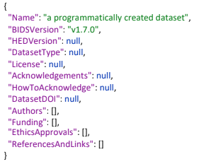

# Create a Derivative
An important functionality of ancpBIDS is to write derivatives from the [in-memory graph](https://ancplaboldenburg.github.io/ancpbids_documentation/extra/inmemory.html) to your local disk. The examples in this page cover how to:
1. Create a derivative in the memory graph, with different folders and subfolders
2. Create artifacts.

 
## Create a Derivative in the Memory Graph
The function `create_derivative` registers a derivative within the in-memory graph. This derivative will be given a name (e.g., _"Meg_QC"_) and it will be created within the derivatives' folder of your BIDS dataset. This step only defines the in-memory graph, and it will be written in the local disk later on.

```bash
  DERIVATIVE_NAME = "Meg_QC"
  derivative = dataset.create_derivative(name= DERIVATIVE_NAME)
```
You can also add a description to the derivatives folder:

```bash

   derivative.dataset_description.GeneratedBy.Name = "MEG header extraction"

```


### Create Folders & Subfolders
You can use the function `create_folder` to create new folders and subfolders, for example for specific pipelines (e.g., _"calculation/"_).

```bash

    PIPELINE_FOLDER = "calculation" 
    calculation_folder = derivative.create_folder(name = PIPELINE_FOLDER)

```


You can also use the function `create_folder` to create the subject folders specifying the `schema`.

```bash

# we first query the subject list
subjects: List[str] = sorted(list(dataset.query_entities(scope=SCOPE).get("subject", [])))
print(subjects)
# ['009']

# then we create a for loop subject-wise to obtain every participant's ID (sid)
for sid in subjects:

  subject_folder = calculation_folder.create_folder(
            type_=schema.Subject,
            name="sub-" + sid
  )

```

## Artifacts
ancpBIDS works with `artifacts`, which are internal representations of BIDS files. An `artifact` is not the file itself, but a structured object that stores BIDS entities, suffix, extension and other metadata. In ancpBIDS, the derivative files can be created first as an `artifact` before being written to disk.

**1. Query the raw artifact**

The queried entities will be used for the creation of the derivative `artifact`.

```bash

SCOPE = "raw"
SUFFIX = "meg"
EXTENSIONS = [".fif", ".fif.gz"]

raw_artifacts = list(dataset.query(
    subj=sid,
    suffix=SUFFIX,
    scope=SCOPE,
    extension=EXTENSIONS,
    return_type="object",
)) # sid is used within the previously explained participant-wise for loop

print(raw_artifacts)

#Output:
# [{'name': 'sub-009_ses-1_task-deduction_run[...]', 'extension': '.fif', 'suffix': 'meg'}, {'name': 'sub-009_ses-1_task-induction_run[...]', 'extension': '.fif', 'suffix': 'meg'}]

```


**2. Create derivative artifact linked to the raw artifact**

This allow us to ensure that the derivative `artifact` inherits the correct BIDS entities and keeps consitency the raw `artifact`.


```bash

for raw_art in raw_artifacts
# for loop artifact-wise within the participant-wise for loop
# raw art is an existing raw artifact representing a MEG file

  meg_artifact = subject_folder.create_artifact(raw=raw_art)
# creates a new derivative artifact that inhertis the BIDS entities of the raw file

# Entities / naming
  DESC = "mneheader"
  meg_artifact.add_entity("desc", DESC)
# adds an additional BIDS entitity ("desc") to specific the description ("mneheader")
  meg_artifact.suffix = "meg"
  meg_artifact.extension = ".json"
```

## Write derivative to disk
This is the last step. 

  with temporary_dataset_base(dataset, output_root):
        ancpbids.write_derivative(dataset, derivative)


def temporary_dataset_base(dataset, base_dir: str):
    """
    Same as MEGqc: temporarily redirect where ancpbids writes derivatives,
    without breaking how raw files are located.
    """
    original_base = getattr(dataset, "base_dir_", None)
    dataset.base_dir_ = base_dir
    try:
        yield
    finally:
        dataset.base_dir_ = original_base


<!--
## very old

`write_derivative()` saves the provided derivative folder to the dataset. Note that a ‘derivatives’ folder will be created if not present. Optionally, you may also use the `DatasetOptions` class to set your preference in the handling of writing a derivative to your file system.


```bash
from ancpbids import write_derivative

target_dir = '/path/to/your/target/directory'
write_derivative(dataset, target_dir)
```


```{important}

TODO: provide a more elaborative example using write_derivative() (deprecated) and artifact.write() (preferred)

```


# Saving a Dataset

Once you've queried and worked with your BIDS dataset, you may want to save your dataset to your local file system. This can be done with several functions. 
the ´load_dataset()´ function. Optionally, you may also  also use the ´DatasetOptions´ class to set your preference in the handling of reading (and writting) a dataset from your file system. In the following example we will use the ´dataset_path´ you have queried beforehand.

## Saving a Dataset
Once your work is finished with your dataset, you can save it back to disk using ´save_dataset()´. Your ´target directory´ should be empty.


    from ancpbids import save_dataset

    target_dir = '/path/to/your/traget/directory'
    save_dataset(dataset, target_dir)

    #ValueError: No file writer registered for file: /.../sub-009_ses-1_scans.tsv


When calling `save_dataset()`, the [in-memory graph](https://ancplaboldenburg.github.io/ancpbids_documentation/extra/inmemory.html) materializes as a new folder on disk. This is done "schema-aware": following the syntax and the semantic BIDS specification, such as naming Artifacts with correct key-value pairs. The new folder will contain the [dataset_description.json](https://alexisbaxman.github.io/ancpbids_documentation/extra/inmemory.html#the-model-of-a-bids-dataset), with the field `BIDSVersion` derived directly from the schema.



```{note}
For each subject, a separate folder is created, and **Artifacts are named automatically:** the key-value information (such as *'sub-09'*) is inferred from the folder structure. This writting functionally allows to export fully valid BIDS derivatives dynamically and automatic within pipelines. 

```
-->


